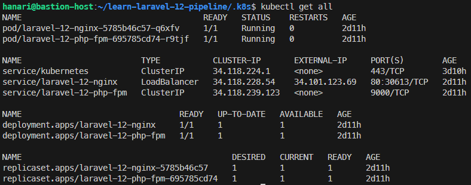
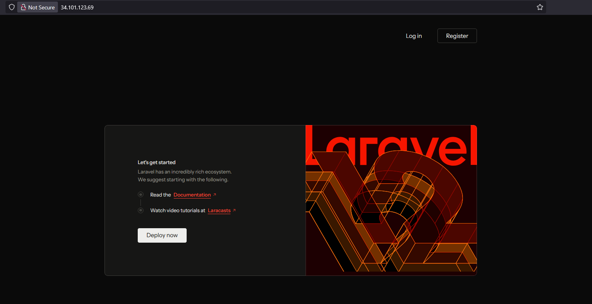

# DevOps CI/CD Pipeline

Repositori ini merupakan contoh implementasi otomatisasi proses Continuous Integration dan Continuous Deployment (CI/CD) menggunakan GitHub Actions. Workflow ini mencakup tahap pengujian dengan Pest, pembuatan container image, push ke GitHub Container Registry, dan deployment ke Google Kubernetes Engine (GKE).

Aplikasi yang dideploy adalah Vue Starter Kit berbasis Laravel, yang mencakup fitur basic authentication dan dashboard sederhana.

### Prerequisites:

1. **Google Cloud Platform (GCP)**  
   Deployment aplikasi dilakukan ke layanan yang tersedia di Google Cloud Platform.

2. **Infrastructure as Code (IaC)**  
   Infrastruktur GCP dikonfigurasi menggunakan Terraform. Dokumentasi lengkap tersedia di [.github/workflows/README.md](.github/workflows/README.md).

3. **GitHub Container Registry**  
   Image hasil build disimpan di GitHub Container Registry, dan digunakan dalam proses deployment ke Kubernetes.

4. **GitHub Actions**  
   Seluruh proses CI/CD diotomatisasi menggunakan GitHub Actions, mulai dari pengujian, build image, push image, hingga deployment.


## Pipeline CI/CD

### Pipeline CI (Continuous Integration)

Pipeline CI berjalan otomatis pada setiap push atau pull request ke branch `main` dan `dev`:

- **Testing**: Menjalankan test dengan Pest
- **Linting**: Memeriksa kode dengan ESLint dan Laravel Pint
- **Build**: Membangun assets dan Docker images
- **Push Images**: Push images ke GitHub Container Registry

### Pipeline CD (Continuous Deployment)

Pipeline CD melakukan deployment otomatis:

- **Trigger**: Berjalan otomatis setelah CI berhasil di branch `main`
- **Manual Trigger**: Dapat dijalankan manual melalui GitHub Actions UI
- **SSH Deployment**: Koneksi ke bastion host untuk deployment
- **Kubernetes**: Menerapkan manifest dengan `kubectl apply`

### Alur Pipeline

```
Code Push → CI Pipeline → Build Images → CD Pipeline → Deploy to K8s
     ↓           ↓            ↓            ↓            ↓
   Tests    Lint/Build   Push to GHCR   SSH to Host   kubectl apply
```

Untuk informasi lebih detail tentang pipeline, lihat di [.github/workflows/README.md](.github/workflows/README.md).

---

## Deploy ke GKE

### 1. Masuk ke VM (Compute Engine di GCP) melalui SSH:
    ```bash
    ssh gcp-bastion
    ```

###  2. Install `kubectl` dengan mengikuti dokumentasi resmi:
[https://kubernetes.io/docs/tasks/tools/install-kubectl-linux/](https://kubernetes.io/docs/tasks/tools/install-kubectl-linux/)

### 3. Koneksikan VM ke cluster GKE:
```bash
gcloud container clusters get-credentials dev-home-lab-cluster --zone asia-southeast2-a --project dev-home-lab
```

### 4. Clone repository `learn-laravel-12-pipeline`:
```bash
git clone https://github.com/hana-ri/learn-laravel-12-pipeline.git
```

### 5. Masuk ke folder `.k8s`:
```bash
cd learn-laravel-12-pipeline/.k8s
```

### 6. jika container registry private buat secret untuk authentifikasi (opsional)
```bash
kubectl create secret docker-registry laravel-12-ghcr-secret \
  --docker-server=ghcr.io \
  --docker-username=user \
  --docker-password=password \
  --docker-email=user@gmail.com
```

### 7. Buat secret untuk aplikasi laravel
```bash
cat <<EOF > secrets.yml
apiVersion: v1
kind: Secret
metadata:
  name: laravel-12-app-secrets
  labels:
    app: laravel-12-app
type: Opaque
data:
  APP_KEY: ""
  DB_USERNAME: ""
  DB_PASSWORD: ""
  REDIS_PASSWORD: ""
  MAIL_USERNAME: ""
  MAIL_PASSWORD: ""
EOF
```
**note**: sesuaikan isinya dan jangan lupa encode ke bas64.

### 6. Apply seluruh manifest Kubernetes:
```bash
kubectl apply -f .
```

### 7. Cek hasil deploy
```bash
kubectl get all
```
Output:


### 8. Coba akses alamat IP yang didapatkan semisal pada contoh ini adalah `34.101.123.69`

Output:


---

## Docker Environment Development

Proyek ini menyediakan environment development berbasis Docker untuk aplikasi Laravel 12.

## Prasyarat

- Docker dan Docker Compose terinstall
- GNU Make (biasanya sudah terinstall di Linux/macOS)

## Memulai

### 1. Build environment development
```bash
make build
```

### 2. Menjalankan environment development
```bash
make start
```

### 3. Menghentikan environment development
```bash
make stop
```

### 4. Restart environment development
```bash
make restart
```

untuk infomasi lainnya dapat dilihat dengan cara menjalankan `make info`